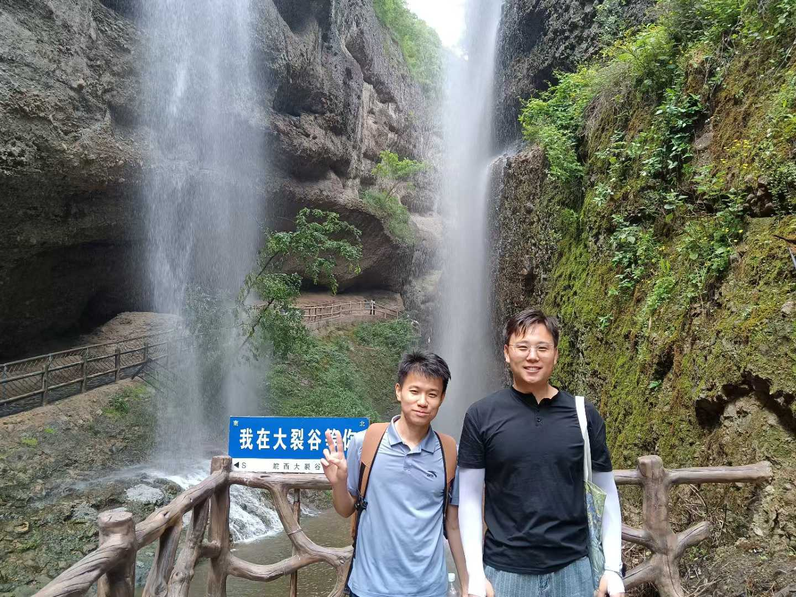
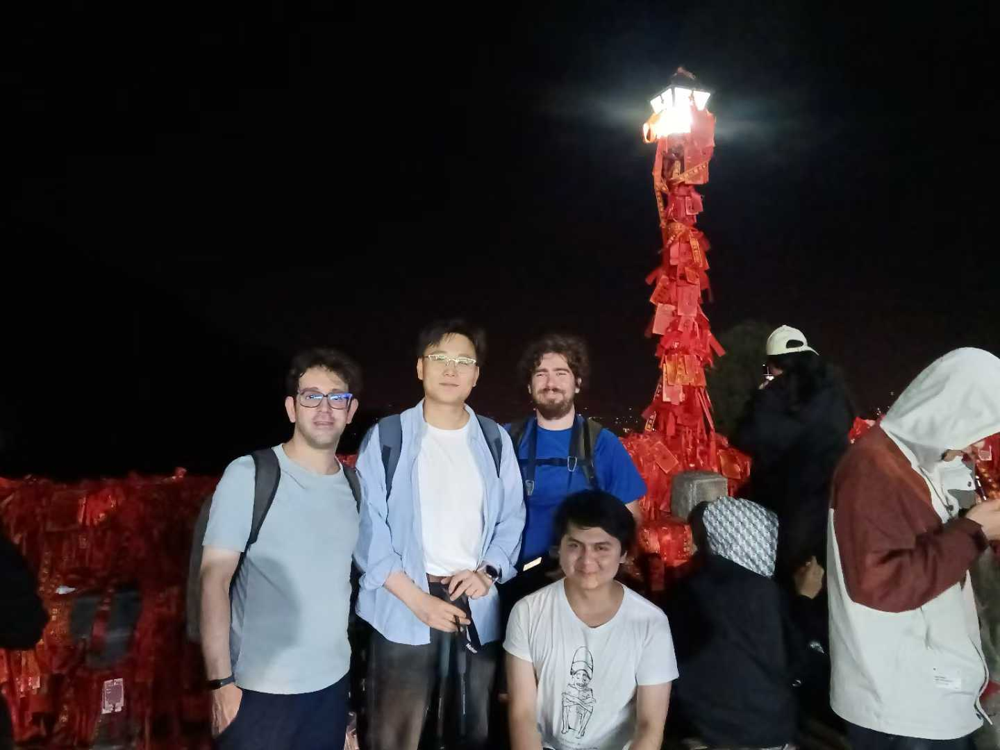
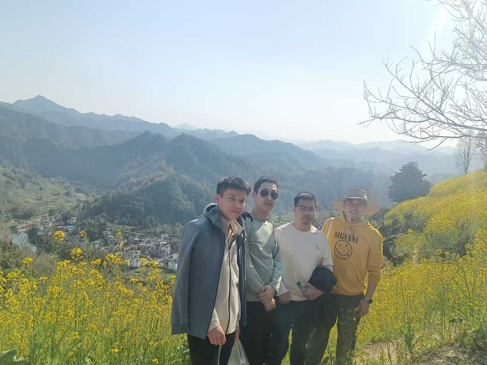
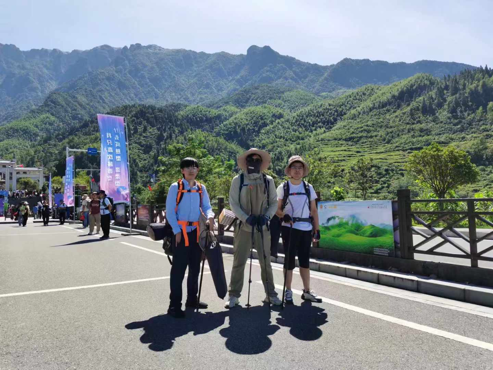
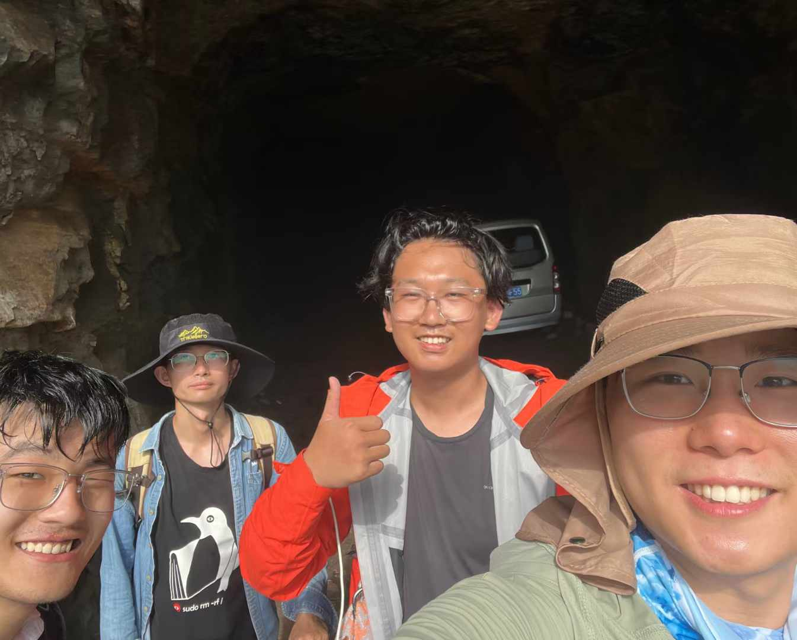

Hiking is one of my favorite hobbies. It allows me to explore beautiful landscapes and stay active.

I usually hike on weekends and take photos of nature.

### Get Started
- 👉 [**Create a new site**](https://hugoblox.com/templates/)

  <figure style="width: 24%;">
    
    <figcaption style="text-align: center;">Western Anhui Grand Canyon, 2025-05-18</figcaption>
  </figure>
  <figure style="width: 24%;">
    
    <figcaption style="text-align: center;">Mount Tai， 2025-04-20</figcaption>
  </figure>
  <figure style="width: 24%;">
    
    <figcaption style="text-align: center;">She County, 2025-03-22</figcaption>
  </figure>
  <figure style="width: 24%;">
    
    <figcaption style="text-align: center;">Wugong Mountain, 2024-10-01</figcaption>
  </figure>
  <figure style="width: 24%;">
    
    <figcaption style="text-align: center;">Southern Taihang Mountains, 2024-07-31</figcaption>
  </figure>

