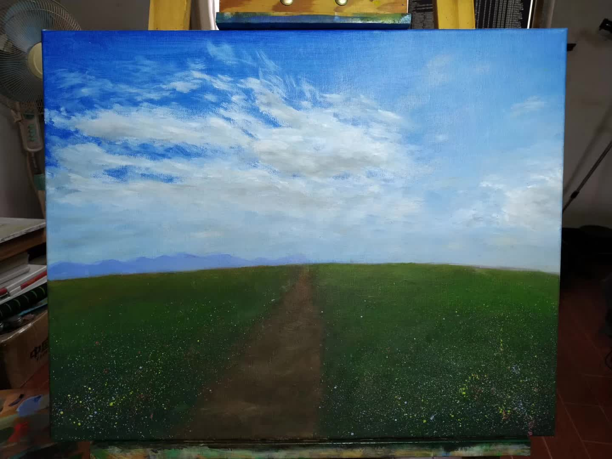
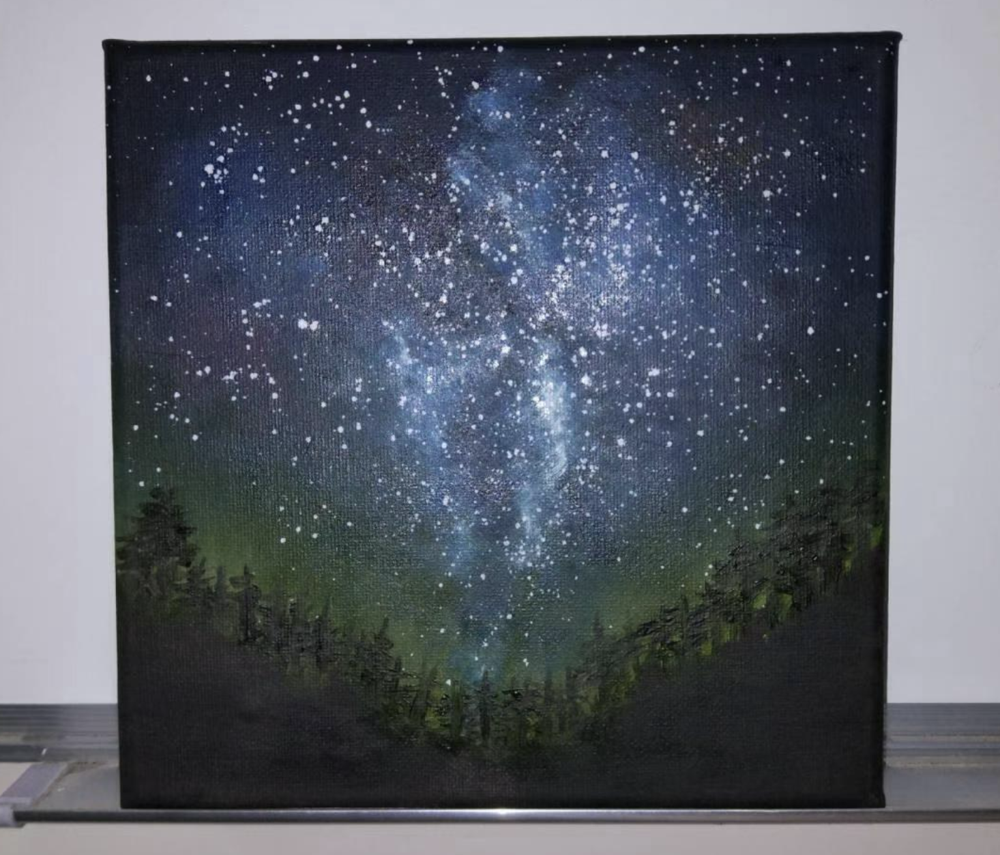
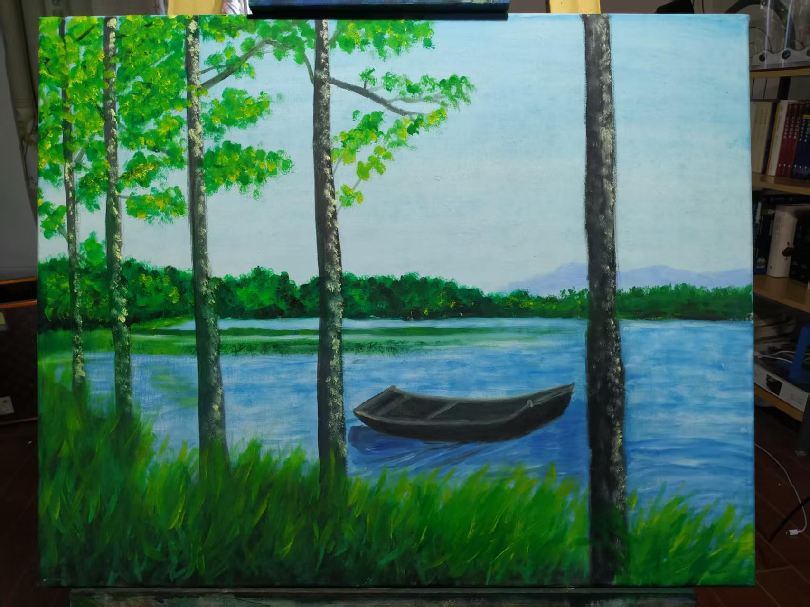
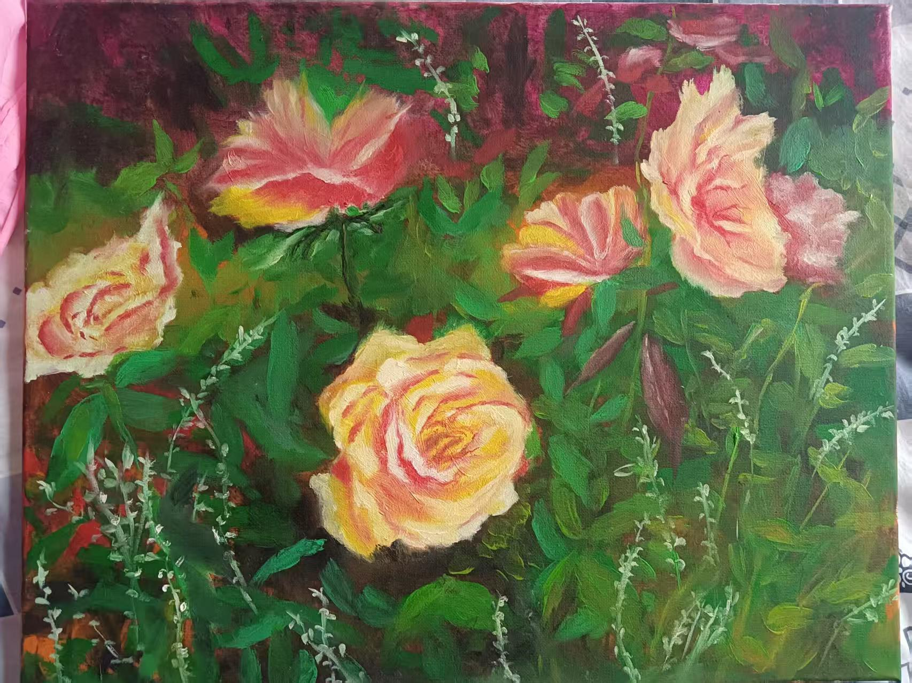

I am an amateur painter without formal training, gotta keep learning and trying 🎨🖼️

  <figure style="width: 32%; margin-bottom: 1%;">
    
    <figcaption style="text-align: center;">A Forest Path at Dawn</figcaption>
  </figure>
  <figure style="width: 32%; margin-bottom: 1%;">
    
    <figcaption style="text-align: center;">The Distant Road</figcaption>
  </figure>
  <figure style="width: 32%; margin-bottom: 1%;">
    
    <figcaption style="text-align: center;">A Starry Night</figcaption>
  </figure>
  <figure style="width: 32%; margin-bottom: 1%;">
    
    <figcaption style="text-align: center;">The Silent Side</figcaption>
  </figure>
  <figure style="width: 32%; margin-bottom: 1%;">
    
    <figcaption style="text-align: center;">Woman with an Umbrella</figcaption>
  </figure>
  <figure style="width: 32%; margin-bottom: 1%;">
    
    <figcaption style="text-align: center;">A Boat</figcaption>
  </figure>
  <figure style="width: 32%; margin-bottom: 1%;">
    
    <figcaption style="text-align: center;">Some Flowers</figcaption>
  </figure>

---

