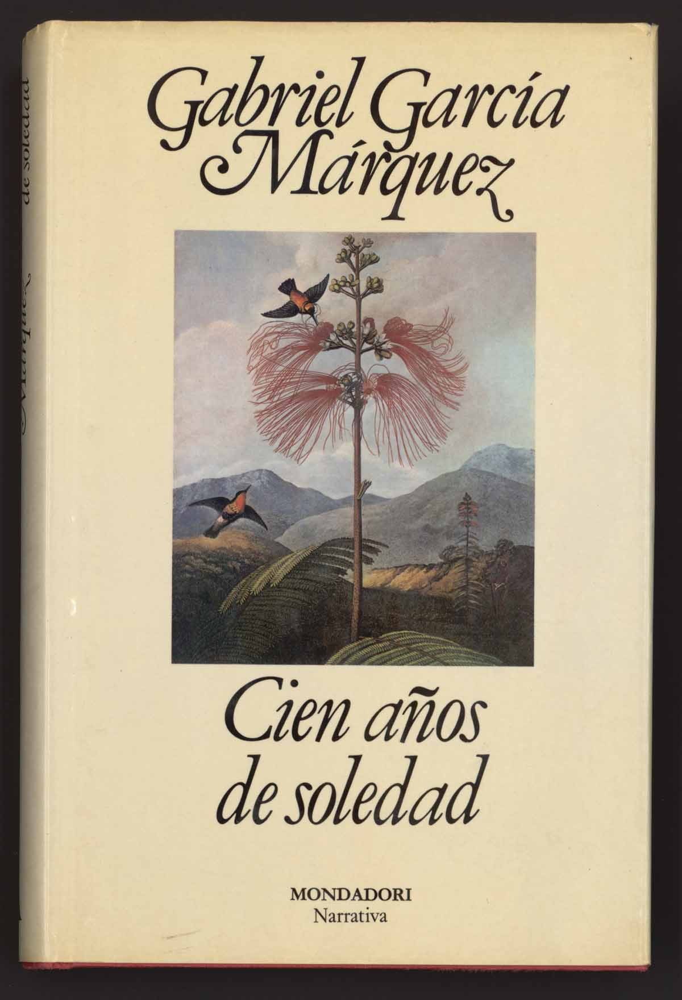

  <figure style="width: 32%; margin-bottom: 1%;">
    
    <figcaption style="text-align: center;">One hundred years of solitude: Beautiful story. Read it once—you’ll want to read it ten more times!</figcaption>
  </figure>

