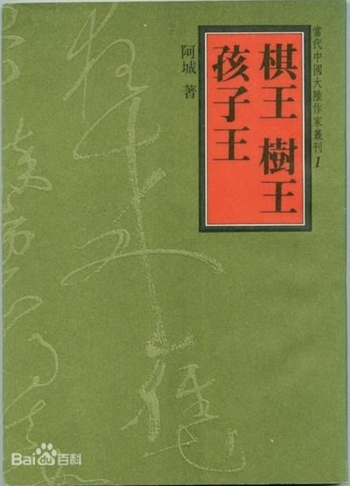
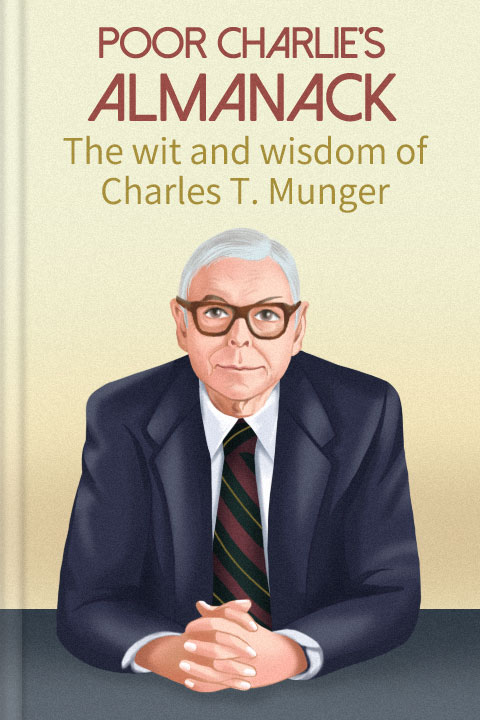

  <figure style="width: 32%; margin-bottom: 1%;">
    
    <figcaption style="text-align: center;">
    <a href="https://en.wikipedia.org/wiki/One_Hundred_Years_of_Solitude" target="_blank">
      One Hundred Years of Solitude
    </a>
    

    
👉 Show comment

      A beautiful story. Read it once—you’ll want to read it ten more times! 
      Score: 🍔🍔🍔🍔🍔
    

    </figcaption>
  </figure>

  <figure style="width: 32%; margin-bottom: 1%;">
    
    <figcaption style="text-align: center;">
    <a href="https://en.wikipedia.org/wiki/Selected_Works_of_Mao_Tse-Tung" target="_blank">
      毛泽东选集
    </a>
    

    
👉 Show comment

      这些书籍充满了智慧和策略——是年轻人成长过程中必读的书籍。你可以从中汲取力量和自信。青年人是冉冉升起的太阳，是世界的希望！ 
      Score: 🍔🍔🍔🍔🍔
    

    </figcaption>
  </figure>

  <figure style="width: 32%; margin-bottom: 1%;">
    
    <figcaption style="text-align: center;">
    <a href="https://en.wikipedia.org/wiki/Romance_of_the_Three_Kingdoms" target="_blank">
      三国演义
    </a>
    

    
👉 Show comment

      “不求同年同月同日生——但求同年同月同日死。”
      一个野蛮的时代，一段传奇的故事！ 
      Score: 🍔🍔🍔🍔🍔
    

    </figcaption>
  </figure>

  <figure style="width: 32%; margin-bottom: 1%;">
    
    <figcaption style="text-align: center;">
    <a href="https://zh.wikipedia.org/wiki/%E5%9B%B4%E5%9F%8E_(%E5%B0%8F%E8%AF%B4)" target="_blank">
      围城
    </a>
    

    
👉 Show comment

      语言幽默风趣，讽刺辛辣深刻，书中无不彰显钱老的智慧，是一本伟大的小说。 
      Score: 🍔🍔🍔🍔
    

    </figcaption>
  </figure>

  <figure style="width: 32%; margin-bottom: 1%;">
    
    <figcaption style="text-align: center;">
    <a href="https://zh.wikipedia.org/zh-cn/%E6%9C%9D%E8%8A%B1%E5%A4%95%E6%8B%BE" target="_blank">
      朝花夕拾
    </a>
    

    
👉 Show comment

      每年必读，长长硬骨头。 
      Score: 🍔🍔🍔🍔
    

    </figcaption>
  </figure>

  <figure style="width: 32%; margin-bottom: 1%;">
    
    <figcaption style="text-align: center;">
    <a href="https://en.wikipedia.org/wiki/Sapiens:_A_Brief_History_of_Humankind" target="_blank">
      Sapiens: A Brief History of Humankind
    </a>
    

    
👉 Show comment

      What shocked and inspired me most in this book was a particular idea — and as I recount it now, I am already demonstrating its truth. The greatest difference between humans and animals, and also the source of our greatest strength, lies in our ability to create stories, understand stories, and believe in stories!!! 
      Score: 🍔🍔🍔🍔
    

    </figcaption>
  </figure>

  <figure style="width: 32%; margin-bottom: 1%;">
    
    <figcaption style="text-align: center;">
    <a href="https://book.douban.com/subject/25712493/" target="_blank">
      世间我所中意的美好
    </a>
    

    
👉 Show comment

      我最钟爱的诗集，William Butler Yeats 写下了我所中意的美好💜. 
      Score: 🍔🍔🍔🍔
    

    </figcaption>
  </figure>

  <figure style="width: 32%; margin-bottom: 1%;">
    
    <figcaption style="text-align: center;">
    <a href="https://www.goodreads.com/book/show/19044873" target="_blank">
      五味
    </a>
    

    
👉 Show comment

      每次读到这本书，总感到一种深至内心的轻松与温柔。原来好好地吃好每一餐饭，是一件幸福到心缝里的事儿。 
      Score: 🍔🍔🍔🍔
    

    </figcaption>
  </figure>

  <figure style="width: 32%; margin-bottom: 1%;">
    
    <figcaption style="text-align: center;">
    <a href="https://en.wikipedia.org/wiki/The_Border_Town" target="_blank">
      边城
    </a>
    

    
👉 Show comment

      在我心神向往的地方，发生的一段动人爱情故事。 
      Score: 🍔🍔🍔🍔
    

    </figcaption>
  </figure>

  <figure style="width: 32%; margin-bottom: 1%;">
    
    <figcaption style="text-align: center;">
    <a href="https://en.wikipedia.org/wiki/The_Catcher_in_the_Rye" target="_blank">
      The Catcher in the Rye
    </a>
    

    
👉 Show comment

      This is a monologue of a boy who refuses to be disciplined, resisting the adult world.
      First time reading it, I really hated this book;
      Second time reading it, I really hated this book;
      Third time reading it, I was greatly shaken.
      If you ask me why I read it three times, Because I feel like it. 
      Score: 🍔🍔🍔🍔
    

    </figcaption>
  </figure>

  <figure style="width: 32%; margin-bottom: 1%;">
    
    <figcaption style="text-align: center;">
    <a href="https://baike.baidu.com/item/%E9%87%8F%E5%AD%90%E5%8A%9B%E5%AD%A6%E6%95%99%E7%A8%8B%EF%BC%88%E7%AC%AC%E4%B8%89%E7%89%88%EF%BC%89/23743748" target="_blank">
      量子力学教程（第三版）
    </a>
    

    
👉 Show comment

      读过三十几遍的教材，再次看到还是会有所触动！ 
      Score: 🍔🍔🍔🍔
    

    </figcaption>
  </figure>

  <figure style="width: 32%; margin-bottom: 1%;">
    
    <figcaption style="text-align: center;">
    <a href="https://zh.wikipedia.org/wiki/%E4%B8%80%E5%8F%A5%E9%A1%B6%E4%B8%80%E4%B8%87%E5%8F%A5" target="_blank">
      一句顶一万句
    </a>
    

    
👉 Show comment

      找一个能说得上话的人，是很难的事儿。但是话是不是有点太密了？正着说，反着说，颠来倒去地说。 
      Score: 🍔🍔🍔🍔
    

    </figcaption>
  </figure>

  <figure style="width: 32%; margin-bottom: 1%;">
    
    <figcaption style="text-align: center;">
    <a href="https://en.wikipedia.org/wiki/Walden" target="_blank">
      Walden
    </a>
    

    
👉 Show comment

      A place where the soul finds rest.  
      Score: 🍔🍔🍔
    

    </figcaption>
  </figure>

  <figure style="width: 32%; margin-bottom: 1%;">
    
    <figcaption style="text-align: center;">
    <a href="https://en.wikipedia.org/wiki/Leaves_of_Grass" target="_blank">
      Leaves of Grass
    </a>
    

    
👉 Show comment

      A heartfelt poetry collection. 
      Score: 🍔🍔🍔
    

    </figcaption>
  </figure>

  <figure style="width: 32%; margin-bottom: 1%;">
    
    <figcaption style="text-align: center;">
    <a href="https://www.goodreads.com/book/show/166350.Stray_Birds" target="_blank">
      Stray Birds
    </a>
    

    
👉 Show comment

      While reading this book, you can feel the unique exotic atmosphere, the humid air, vibrant colors, a mysterious ambiance, the swaying banana trees, the chirping of insects and birds, and the starry moonlit night. 
      Score: 🍔🍔🍔
    

    </figcaption>
  </figure>

  <figure style="width: 32%; margin-bottom: 1%;">
    
    <figcaption style="text-align: center;">
    <a href="https://en.wikipedia.org/wiki/The_Lover_(Duras_novel)" target="_blank">
      The Lover (Duras novel)
    </a>
    

    
👉 Show comment

      I can't tell whether this is true love or a twisted emotion disguised as true love. 
      Score: 🍔🍔🍔
    

    </figcaption>
  </figure>

  <figure style="width: 32%; margin-bottom: 1%;">
    
    <figcaption style="text-align: center;">
    <a href="https://baike.baidu.com/item/%E6%A3%8B%E7%8E%8B%E6%A0%91%E7%8E%8B%E5%AD%A9%E5%AD%90%E7%8E%8B/12290818" target="_blank">
      棋王树王孩子王
    </a>
    

    
👉 Show comment

      阿城的文字是无可挑剔的，对人物的描写也是细腻深刻的，值得细读！ 
      Score: 🍔🍔🍔
    

    </figcaption>
  </figure>

  <figure style="width: 32%; margin-bottom: 1%;">
    
    <figcaption style="text-align: center;">
    <a href="https://baike.baidu.com/item/%E5%8D%97%E8%B4%A7%E5%BA%97/51855882" target="_blank">
      南货店
    </a>
    

    
👉 Show comment

      我喜欢这个温情而略带残酷的故事。一个人一辈子要经历多少磨难？而这些故事在人故去之后是否还会有回响？ 
      Score: 🍔🍔🍔
    

    </figcaption>
  </figure>

  <figure style="width: 32%; margin-bottom: 1%;">
    
    <figcaption style="text-align: center;">
    <a href="https://en.wikipedia.org/wiki/The_Fault_in_Our_Stars" target="_blank">
      The Fault in Our Stars
    </a>
    

    
👉 Show comment

      I was fortunate to read this book in the days of my youth. Thus, while I still possessed my youth, I also came to possess a sense of what youth feels like. 
      Score: 🍔🍔🍔
    

    </figcaption>
  </figure>

  <figure style="width: 32%; margin-bottom: 1%;">
    
    <figcaption style="text-align: center;">
    <a href="https://en.wikipedia.org/wiki/Sophie%27s_World" target="_blank">
      Sophie's World
    </a>
    

    
👉 Show comment

      An interesting book that takes you through the evolutionary history of philosophy — a great introduction to philosophy. 
      Score: 🍔🍔🍔
    

    </figcaption>
  </figure>

  <figure style="width: 32%; margin-bottom: 1%;">
    
    <figcaption style="text-align: center;">
    <a href="https://en.wikipedia.org/wiki/All_Creatures_Great_and_Small_(franchise)" target="_blank">
      All Creatures Great and Small (franchise)
    </a>
    

    
👉 Show comment

      These stories will make you realize the beauty of life.  
      Score: 🍔🍔🍔
    

    </figcaption>
  </figure>

  <figure style="width: 32%; margin-bottom: 1%;">
    
    <figcaption style="text-align: center;">
    <a href="https://baike.baidu.com/item/%E6%B2%A7%E6%B5%AA%E4%B9%8B%E6%B0%B4/3144669" target="_blank">
      沧浪之水
    </a>
    

    
👉 Show comment

      波云诡谲的权利斗争。我也要当卫生局局长！ 
      Score: 🍔🍔🍔
    

    </figcaption>
  </figure>

  <figure style="width: 32%; margin-bottom: 1%;">
    
    <figcaption style="text-align: center;">
    <a href="https://en.wikipedia.org/wiki/Poor_Charlie%27s_Almanack" target="_blank">
      Poor Charlie's Almanack
    </a>
    

    
👉 Show comment

      It's an interesting book, but after finishing it, I didn't feel particularly enlightened. Maybe I need to read it a few more times. 
      Score: 🍔🍔🍔
    

    </figcaption>
  </figure>

  <figure style="width: 32%; margin-bottom: 1%;">
    
    <figcaption style="text-align: center;">
    <a href="https://en.wikipedia.org/wiki/The_Grapes_of_Wrath" target="_blank">
      The Grapes of Wrath
    </a>
    

    
👉 Show comment

      This book has deeply made me realize that there is no essential difference between people and between nations. No one is born noble; even nations that once stood at the peak of capitalism have crawled through the mud. Human nature is universal. We all long for love, desire a stable life, and possess similar dark sides as well as great shining qualities. The literary depiction of human nature's brilliance in this book is fully realized in the final scene, leaving me with a profound sense of unease that lingers in my heart.  
      Score: 🍔🍔🍔
    

    </figcaption>
  </figure>

  <figure style="width: 32%; margin-bottom: 1%;">
    
    <figcaption style="text-align: center;">
    <a href="https://en.wikipedia.org/wiki/Silent_Spring" target="_blank">
      Silent Spring
    </a>
    

    
👉 Show comment

      It’s shocking, yet it seems that human society is still stumbling forward. Perhaps everything we do is based on a fundamental assumption: that nature will always find its own way to survive. Or perhaps, we simply don’t care. We revel through the night, until total destruction.  
      Score: 🍔🍔🍔
    

    </figcaption>
  </figure>

  <figure style="width: 32%; margin-bottom: 1%;">
    
    <figcaption style="text-align: center;">
    <a href="https://en.wikipedia.org/wiki/Neapolitan_Novels" target="_blank">
      Neapolitan Novels
    </a>
    

    
👉 Show comment

      I find it so hard to understand women — they're so deep and complex. 
      Score: 🍔🍔🍔
    

    </figcaption>
  </figure>

  <figure style="width: 32%; margin-bottom: 1%;">
    
    <figcaption style="text-align: center;">
    <a href="https://en.wikipedia.org/wiki/84,_Charing_Cross_Road" target="_blank">
      84, Charing Cross Road
    </a>
    

    
👉 Show comment

      A story of friendship across time and space between a person who loves reading and someone who cherishes that love.  
      Score: 🍔🍔🍔
    

    </figcaption>
  </figure>

  <figure style="width: 32%; margin-bottom: 1%;">
    
    <figcaption style="text-align: center;">
    <a href="https://es.wikipedia.org/wiki/Las_venas_abiertas_de_Am%C3%A9rica_Latina" target="_blank">
      Las Venas Abiertas de América Latina
    </a>
    

    
👉 Show comment

      When the fate of a nation is not in the hands of its people, it inevitably means the tragedy of life. Hang in there, friends of Latin America. 
      Score: 🍔🍔🍔
    

    </figcaption>
  </figure>

  <figure style="width: 32%; margin-bottom: 1%;">
    
    <figcaption style="text-align: center;">
    <a href="https://en.wikipedia.org/wiki/Invisible_Child:_Poverty,_Survival_%26_Hope_in_an_American_City" target="_blank">
      Invisible Child: Poverty, Survival & Hope in an American City
    </a>
    

    
👉 Show comment

      The structural poverty caused by capitalist society makes individuals feel powerless and insignificant in the waves of social change. 
      Score: 🍔🍔🍔
    

    </figcaption>
  </figure>

  <figure style="width: 32%; margin-bottom: 1%;">
    
    <figcaption style="text-align: center;">
    <a href="https://zh.wikipedia.org/wiki/%E6%98%8E%E6%9C%9D%E9%82%A3%E4%BA%9B%E4%BA%8B%E5%85%92" target="_blank">
      明朝那些事儿
    </a>
    

    
👉 Show comment

      很有意思的丛书。然而，在这些书中，没有谁是主角，作者才是。本系列书更像是作者对历史的读后感，读时需慎辨主观与客观。 
      Score: 🍔🍔🍔
    

    </figcaption>
  </figure>

  <figure style="width: 32%; margin-bottom: 1%;">
    
    <figcaption style="text-align: center;">
    <a href="https://baike.baidu.com/item/%E7%A5%A5%E7%91%9E%EF%BC%9A%E7%8E%8B%E8%8E%BD%E5%92%8C%E4%BB%96%E7%9A%84%E6%97%B6%E4%BB%A3/58484515" target="_blank">
      祥瑞：王莽和他的时代
    </a>
    

    
👉 Show comment

      书很有趣，又学一课，道术有别。克己复礼、阴谋诡计都是术。而道是济世安民、顺势而为，是光明正道、是大公无私。王莽终究是习术而走火入魔矣。此外，“祥瑞”这个切入点很好！ 
      Score: 🍔🍔🍔
    

    </figcaption>
  </figure>

  <figure style="width: 32%; margin-bottom: 1%;">
    
    <figcaption style="text-align: center;">
    <a href="https://www.goodreads.com/series/372660-diddly-squat" target="_blank">
      Diddly Squat Series by Jeremy Clarkson
    </a>
    

    
👉 Show comment

      A fun series of books that's easy to read, but with a tendency to be overly clever.  
      Score: 🍔🍔🍔
    

    </figcaption>
  </figure>

  <figure style="width: 32%; margin-bottom: 1%;">
    
    <figcaption style="text-align: center;">
    <a href="https://en.wikipedia.org/wiki/Norwegian_Wood_(novel)" target="_blank">
      Norwegian Wood (novel)
    </a>
    

    
👉 Show comment

      Sad and profound.  
      Score: 🍔🍔🍔
    

    </figcaption>
  </figure>

  <figure style="width: 32%; margin-bottom: 1%;">
    
    <figcaption style="text-align: center;">
    <a href="https://en.wikipedia.org/wiki/Educated_(memoir)" target="_blank">
      Educated (memoir)
    </a>
    

    
👉 Show comment

      As long as you keep hope and never give up, you will eventually receive the gifts of fate.  
      Score: 🍔🍔🍔
    

    </figcaption>
  </figure>

  <figure style="width: 32%; margin-bottom: 1%;">
    
    <figcaption style="text-align: center;">
    <a href="https://zh.wikipedia.org/wiki/%E6%96%87%E5%9F%8E_(%E5%B0%8F%E8%AF%B4)" target="_blank">
      文城
    </a>
    

    
👉 Show comment

      我觉得一般，和《一句顶一万句》有点像。 
      Score: 🍔🍔
    

    </figcaption>
  </figure>

  <figure style="width: 32%; margin-bottom: 1%;">
    
    <figcaption style="text-align: center;">
    <a href="https://en.wikipedia.org/wiki/Steve_Jobs_(book)" target="_blank">
      Steve Jobs (book)
    </a>
    

    
👉 Show comment

      If you like Steve Jobs and are interested in his life, then go ahead and read it. 
      Score: 🍔🍔
    

    </figcaption>
  </figure>

  <figure style="width: 32%; margin-bottom: 1%;">
    
    <figcaption style="text-align: center;">
    <a href="https://www.amazon.com/Moscow-December-25th-1991-Soviet/dp/1848271131" target="_blank">
      Moscow, December 25th, 1991: The Last Day of the Soviet Union
    </a>
    

    
👉 Show comment

      This book lists many interesting events and serves as a decent diary. However, the writing style is poor, as it's merely a collection of events without much depth. 
      Score: 🍔🍔
    

    </figcaption>
  </figure>

  <figure style="width: 32%; margin-bottom: 1%;">
    
    <figcaption style="text-align: center;">
    <a href="https://en.wikipedia.org/wiki/The_Little_Prince" target="_blank">
      The Little Prince
    </a>
    

    
👉 Show comment

      It should be a very interesting book, but I just can't get into it. Am I too old for this? 
      Score: 🍔🍔
    

    </figcaption>
  </figure>

  <figure style="width: 32%; margin-bottom: 1%;">
    
    <figcaption style="text-align: center;">
    <a href="https://en.wikipedia.org/wiki/Freedom_(Franzen_novel)" target="_blank">
      Freedom (Franzen novel)
    </a>
    

    
👉 Show comment

      You loved me, but I didn’t love you back. I left you, yet I needed you, so I came back — and you forgave me. In the end, we are all free??? 
      Score: 🍔🍔
    

    </figcaption>
  </figure>

  <figure style="width: 32%; margin-bottom: 1%;">
    
    <figcaption style="text-align: center;">
    <a href="https://baike.baidu.com/item/%E4%B8%AD%E5%9B%BD%E7%A4%BE%E4%BC%9A%E5%90%84%E9%98%B6%E5%B1%82%E5%88%86%E6%9E%90/3368240" target="_blank">
      中国社会各阶层分析
    </a>
    

    
👉 Show comment

      当你看了标题，买了书，准备好读一本翔实的社会研究报告的时候，你会发现生活又欺骗了你。本书是文人的自我感动，书中的主要内容是作者朋友的访谈录，极度主观且几乎无任何科学调研数据。尽管如此，如果对某些阶层人士的心理活动感兴趣的朋友，前200页还是可以看看的。  
      Score: 🍔
    

    </figcaption>
  </figure>

  <figure style="width: 32%; margin-bottom: 1%;">
    
    <figcaption style="text-align: center;">
    <a href="https://en.wikipedia.org/wiki/The_Temple_of_the_Golden_Pavilion" target="_blank">
      The Temple of the Golden Pavilion
    </a>
    

    
👉 Show comment

      The protagonist in the story is both morbid and self-abasing. Yet the prose remains beautiful. 
      Score: 🥦
    

    </figcaption>
  </figure>

  <figure style="width: 32%; margin-bottom: 1%;">
    
    <figcaption style="text-align: center;">
    <a href="" target="_blank">
      塔勒布丛书
    </a>
    

    
👉 Show comment

      都说这些书写得好，真的好吗？不过是掉书袋的装x之作。几句话就能讲清楚，非得写成一套书。害老子读半天... 
      Score: 🥦🥦🥦
    

    </figcaption>
  </figure>

---

---
